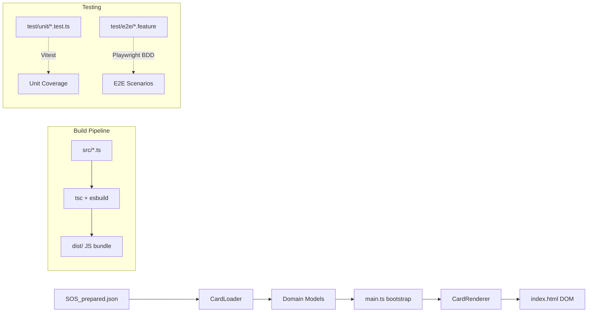
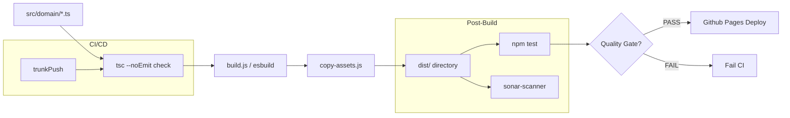
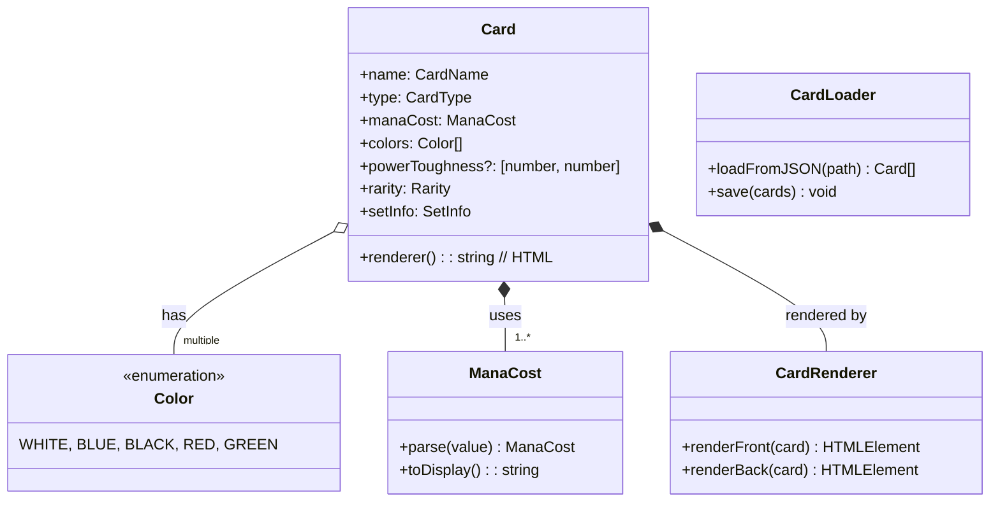
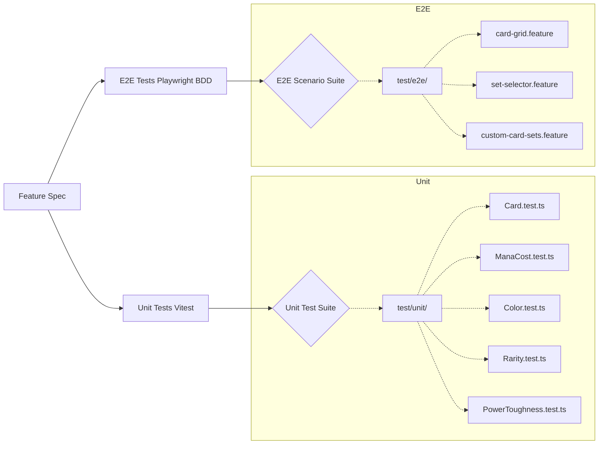

# SC-TCG Project Architecture

## Overview

SC-TCG (Scars of Miracula Trading Card Game) is a web-based Magic: The Gathering card viewer / tabletop companion built with vanilla TypeScript, HTML, and CSS. It loads card data from JSON files and renders them in the browser for gameplay assistance.

**Repository:** https://github.com/julien-amiot/tcg-viewer
**Live Site:** GitHub Pages (automatic deployments on merge to `trunk`)

## Directory Structure

```
z:/Travail/Dev/SC-TCG/20260601/
├── .clinerules                   # Project rules & working instructions
├── .clinerules-architecture.md   # This architecture document (auto-maintained)
├── .env                          # Secrets: SONAR_TOKEN, GITHUB_PAT (git-ignored)
├── .github/workflows/deploy-gh-pages.yml  # CI/CD pipeline
├── package.json                  # Node.js project definition + scripts
├── tsconfig.json                 # TypeScript compiler config (strict mode)
├── vitest.config.ts              # Vitest unit test runner config
├── playwright.config.ts          # Playwright E2E/BDD test config
├── sonar-project.properties      # SonarQube static analysis settings
├── docker-compose.sonar.yml      # Local Docker containers for SonarQube
│
├── CARDS/                        # Card data sources (JSON)
│   └── SOS_prepared.json         # Scars of Miracula card dataset (MTGJSON-derived, pre-processed)
│
├── src/                          # Source code
│   ├── index.html                # Root HTML template / SPA entry point
│   ├── main.ts                   # Application entry point - DOM initialization & bootstrap
│   ├── styles.css                # Global application styles
│   │
│   └── domain/                   # Core business logic layer (pure TypeScript, no framework)
│       ├── Card.ts               # Card entity with name, type, cost, colors, PT, rarity, layout, supertypes, types, frameVersion + CSS class getters
│       ├── CardLoader.ts         # JSON file loader for card data persistence & retrieval
│       ├── CardName.ts           # Card name domain model + validation
│       ├── CardRenderer.ts       # Renders cards using CSS class composition (no inline styles for layout)
│       ├── CardType.ts           # Card type definitions: Creature, Enchantment, Spell, etc.
│       ├── Color.ts              # MTG color system: White, Blue, Black, Red, Green + multicolor
│       ├── InitialLoyalty.ts     # Loyalty value for Planeswalker cards
│       ├── ManaCost.ts           # Mana cost parser/renderer (generic {X}, hybrid, phyrexian)
│       ├── PowerToughness.ts     # Power/Toughness pair with validation (+/- values)
│       ├── Rarity.ts             # Card rarity levels: Common, Uncommon, Rare, Mythic Rare
│       └── SetStorage.ts         # Per-set card storage abstraction (persist cards per expansion set)
│
│   └── design-system/            # Atomic CSS design system (BEM modifiers)
│       ├── index.css             # Barrel import of all design system CSS
│       ├── tokens.css            # CSS custom properties (colors, spacing, typography, shadows)
│       ├── atoms/
│       │   ├── mana-dot.css      # .mana-dot with color modifiers (--W, --U, --B, --R, --G, --WU, etc.)
│       │   ├── rarity.css        # .rarity--common, --uncommon, --rare, --mythic
│       │   ├── color-identity.css # .color-identity--W, --U, --WU, --gold, etc.
│       │   ├── text-shadow.css   # .text-shadow utility
│       │   └── typography.css    # .text-body, .text-white, .text-bold, .text-ellipsis
│       ├── molecules/
│       │   ├── card-header.css   # .card-header, .card-name, .card-mana-dots
│       │   ├── mana-cost.css     # .card-mana-dots
│       │   ├── card-type-row.css # .card-type-row, .card-type, .card-setcode
│       │   ├── card-text.css     # .card-text, .card-flavor-text
│       │   └── card-footer.css   # .card-footer, .card-power-toughness, .card-initial-loyalty
│       ├── organisms/
│       │   └── card.css          # .card base + layout variants (layout--*, type--*, supertype--*, frame--*)
│       └── templates/
│           ├── card-grid.css     # #cardGrid grid layout
│           └── showcase.css      # .showcase-page, .showcase-specimen
│
├── design-system.html            # Design system showcase page (auto-scans cards)
├── design-system.ts              # Showcase page logic (collects specimens by CSS class combo)
│
├── scripts/                      # Build & CI helper scripts
│   ├── build.js                  # esbuild-based bundler + TypeScript transpilation to dist/
│   ├── copy-assets.js            # Copies static assets (styles, images) into dist/
│   ├── create-pr.js              # Creates GitHub PR via REST API (reads GITHUB_PAT from .env)
│   ├── github-log.js             # Posts GitHub PR/issue comments via REST API (reads GITHUB_PAT from .env)
│   ├── pre-push.sh               # Git pre-push hook script (SonarQube gate enforcement)
│   └── sonar-analyze.ts          # GitHub API client for SonarQube issue fetching & status reporting
│
├── test/                         # Test suites
│   ├── __data__/                 # Shared test fixtures / mock data
│   │   └── *.ts                  # Mock card data and test helpers
│   │
│   ├── unit/                     # Vitest unit tests (isolated, no DOM)
│   │   └── *.test.ts             # Tests for each domain class
│   │
│   └── e2e/                      # Playwright BDD end-to-end tests
│       ├── *.feature             # BDD scenario files (Given-When-Then)
│       └── *.test.ts             # GWT implementations
│
├── dist/                         # Build output (generated by `npm run build`)
│   ├── index.html                # Transpiled SPA entry point
│   └── styles.css                # Compiled global styles
│
├── specs.md                      # Feature specification document (authoritative)
├── README.md                     # Project documentation + feature list
└── issues.json / sonar_issues.json  # SonarQube issue reports (temporary)
```

## Architecture Diagrams

### Component Flow



### Build Pipeline



### Domain Model



### Testing Strategy



### CI/CD Pipeline


## Domain Layer Summary

| Class | Purpose |
|-------|---------|
| `Card` | Core entity combining all card attributes |
| `CardName` | Value object for validated card names |
| `CardType` | Enum: Creature, Enchantment, Spell... |
| `Color` | MTG five-color system + multicolor handling |
| `ManaCost` | Parses/generates mana cost strings (e.g. `{2}{U}`, `{X}`, hybrid) |
| `PowerToughness` | Pairs of power and toughness values (can be +/- for flip cards) |
| `Rarity` | Enum: Common, Uncommon, Rare, Mythic Rare |
| `InitialLoyalty` | Planeswalker loyalty value on entry |
| `CardRenderer` | Transforms a Card into its visual HTML representation |
| `CardLoader` | Loads/saves card data from JSON source files |
| `SetStorage` | Per-set storage abstraction for managing multiple expansions |

## Key Architectural Decisions

1. **No framework** - Vanilla TypeScript + plain DOM manipulation (no React, Vue, Svelte)
2. **Pure domain layer** - All business logic in `src/domain/`, no dependencies on browsers or frameworks
3. **JSON-driven data** - Cards loaded from `CARDS/SOS_prepared.json` (MTGJSON-derived, pre-processed)
4. **esbuild build pipeline** - Fast bundling to `dist/` with TypeScript transpilation
5. **Vitest unit tests** - Forks pool for isolation, no file parallelism (avoids race conditions on shared JSON data)
6. **Playwright BDD E2E** - Given-When-Then scenarios in `.feature` files with TypeScript implementations
7. **SonarQube quality gate** - Enforced via pre-push hook; max 300 new lines per push
8. **GitHub-first workflow** - All changes through PRs to `trunk`; no direct pushes/merges
9. **Auto-deploy** - GitHub Pages deployment triggered automatically on merge to `trunk`